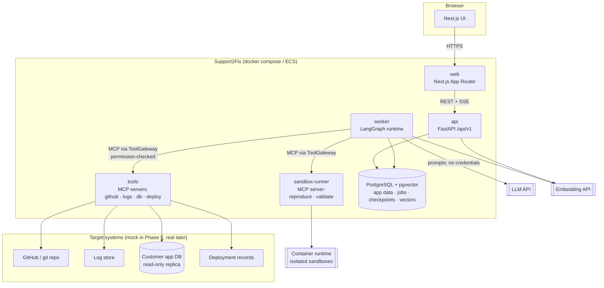
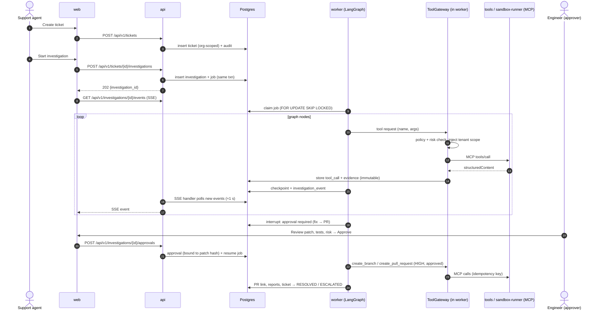
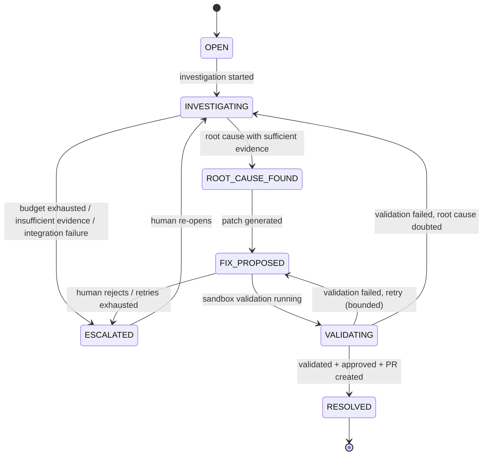
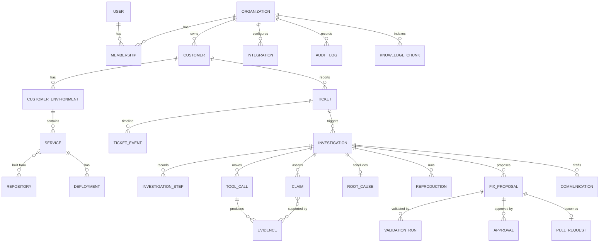

# Support2Fix — System Design

Status: **Proposed (Phase 0)** · Last updated: 2026-09-30
Related: [agent-architecture.md](agent-architecture.md) · [security.md](security.md) · [ADR-001](../decisions/001-architecture.md)

---

## 1. Purpose and scope

Support2Fix turns a customer support ticket into an evidence-backed engineering investigation. It identifies the root cause, reproduces the bug in a sandbox, proposes and validates a fix, and opens a human-approved pull request. It also drafts both an internal report and a customer-safe response.

This document covers the platform's components, data flow, data model, API boundaries, integration strategy and failure handling. The agent internals are in [agent-architecture.md](agent-architecture.md). The threat model and controls are in [security.md](security.md).

### Design goals (in priority order)

1. **Correctness and explainability.** Every claim traces to stored evidence. Unverified hypotheses are never presented as facts.
2. **Safety.** The LLM holds no credentials and can't bypass the permission engine. Side effects need human approval according to risk.
3. **Reproducibility.** Investigations are persisted step by step and can be resumed, replayed and audited.
4. **Operability.** The system is a modular monolith with few moving parts, a single database and standard observability.
5. **Replaceability.** Vendor-specific systems (GitHub, log stores, LLM providers) sit behind interfaces.

### Non-goals (for now)

- Autonomous production changes (deploy or rollback). These are modelled as CRITICAL tools that are **disabled** by default.
- Microservices, service mesh, Kubernetes.
- Multi-region deployment.

---

## 2. High-level architecture

The platform is a **modular monolith**. It's one Python codebase with several entrypoints, plus one Next.js app. The Python process is split into separate runtime units **only where privilege or lifetime differ**:

| Runtime unit | Entrypoint | Why it is separate | Introduced |
|---|---|---|---|
| `web` | Next.js server | Different language/runtime | Phase 1 |
| `api` | FastAPI (uvicorn) | Short, user-facing request/response work | Phase 1 |
| `worker` | Python job runner | Investigations take minutes, so they must not live inside HTTP requests | Phase 9 |
| `tools` | MCP servers (streamable HTTP) | Holds integration credentials. The LLM-facing worker never does. | Phase 7 |
| `sandbox-runner` | MCP server exposing reproduction/validation | Only component allowed to start containers, which is the highest-privilege component | Phase 12 |
| `postgres` | PostgreSQL + pgvector | App data, job queue, LangGraph checkpoints, embeddings | Phase 1 |

`worker`, `tools` and `sandbox-runner` are built from the **same Docker image and codebase** as `api`. The only difference is the start command. That keeps it a monolith for development and a set of least-privilege processes at runtime.



### Why these boundaries

- **The worker has no integration credentials.** It sees tool results only. A prompt-injected model can at most ask the ToolGateway for a tool call, and the gateway enforces policy.
- **Only the sandbox-runner can talk to the container runtime.** Access to the Docker API is equivalent to root on the host, so it's confined to one small, auditable process. See [security.md §7](security.md#7-sandbox-isolation).
- **Everything goes through PostgreSQL.** Queue, checkpoints, vectors and audit share one database. The spec's technology list has no Redis, Kafka or separate vector database, and one database keeps backup and restore and transactional consistency simple. We revisit this if measured load requires it.

---

## 3. Repository layout

The repo is a monorepo rooted at this directory. It follows the suggested structure, with the additions noted below.

```text
support2fix/
├── apps/
│   ├── web/                    # Next.js 16 (App Router), TypeScript, Tailwind
│   │   ├── app/                # routes: /dashboard, /tickets, /investigations/[id], ...
│   │   ├── components/
│   │   ├── lib/                # API client (types generated from OpenAPI), auth helpers
│   │   └── tests/
│   └── api/                    # Python package; one image, several entrypoints
│       ├── app/
│       │   ├── api/            # FastAPI routers (v1), dependencies
│       │   ├── core/           # config, logging, security, telemetry, errors
│       │   ├── models/         # SQLAlchemy ORM models
│       │   ├── schemas/        # Pydantic request/response models
│       │   ├── repositories/   # data access; every method takes an OrgContext
│       │   ├── services/       # business logic
│       │   ├── integrations/   # (added) vendor adapters behind interfaces (Phase 6)
│       │   ├── mcp/            # (added detail) MCP servers + ToolGateway client (Phase 7-8)
│       │   ├── agents/         # LangGraph graphs, nodes, prompts, LLM client (Phase 9+)
│       │   ├── sandbox/        # (added) sandbox runner (Phase 12)
│       │   ├── worker/         # (added) job queue consumer (Phase 9)
│       │   └── tests/
│       ├── alembic/            # (added) migrations
│       └── pyproject.toml      # (changed) + lockfile instead of bare requirements.txt
├── examples/
│   └── shopmock/               # (added) mock e-commerce target system (Phase 5)
├── evals/                      # (added) benchmark incidents + runner (Phase 20)
├── infrastructure/
│   ├── docker/
│   ├── terraform/
│   └── github-actions/         # workflow sources; active copies live in .github/workflows
├── docs/
├── scripts/
├── docker-compose.yml
├── .env.example
└── README.md
```

Changes from the suggested structure, and why:

- **`pyproject.toml` + lockfile** instead of a bare `requirements.txt`. A lockfile makes builds reproducible, and reproducibility is a stated goal. A `requirements.txt` can still be exported for tools that need one.
- **`examples/shopmock/`** keeps the mock target system out of the platform code. It's something Support2Fix investigates, not part of Support2Fix.
- **`evals/`** sits at the top level because the benchmark dataset is versioned data, not application code.
- **`integrations/`, `sandbox/`, `worker/`** are explicit packages so dependency direction is easy to enforce: `agents` → `mcp` client → (network) → `mcp` servers → `integrations`.

---

## 4. Technology choices

Versions get pinned in Phase 1 against the current releases at that time. The majors below reflect the research done for Phase 0.

| Layer | Choice | Notes |
|---|---|---|
| Frontend | Next.js 16 (App Router), React 19.2, TypeScript (strict), Tailwind CSS 4 | App Router is stable. The Pages Router is in maintenance mode. |
| API | FastAPI, Pydantic v2, SQLAlchemy 2.x (async), Alembic | Async sessions via dependency injection. Migrations from day one. |
| DB driver | **psycopg 3** (async) | The LangGraph Postgres checkpointer uses psycopg, so using it for SQLAlchemy too means one driver. |
| Database | PostgreSQL 17+ with pgvector ≥ 0.8 | HNSW indexes. Iterative index scans for filtered (tenant-scoped) vector search. |
| Orchestration | LangGraph 1.x `StateGraph` + `AsyncPostgresSaver` checkpointer | `interrupt()` / `Command(resume=…)` for human approval gates |
| LLM | Provider-agnostic `LLMClient` interface. Default implementation uses Anthropic Claude via the official `anthropic` SDK. | See [agent-architecture.md §7](agent-architecture.md#7-llm-layer) |
| Embeddings | `EmbeddingProvider` interface. Default: **local `fastembed`** (ONNX, `BAAI/bge-small-en-v1.5`, 384-dim). | No API key, no GPU, no PyTorch, deterministic. Anthropic has no embeddings endpoint. A hosted provider can be plugged in later. |
| Tools | MCP (spec **2026-07-28**, official Python SDK) over streamable HTTP | Stateless protocol core, `outputSchema` / `structuredContent` |
| Real-time UI | **Server-Sent Events** for investigation progress. The SSE endpoint polls the `investigation_events` table. | See ADR-001 D9. Simpler than WebSockets, and polling is simpler than LISTEN/NOTIFY. |
| Auth | Server-side sessions: an opaque token in an `HttpOnly` cookie, hashed in the DB | See ADR-001 D10. No JWT/refresh-token machinery, and revocation is a row delete. |
| Browser → API | Next.js rewrites `/api/*` to the FastAPI service | The browser sees one origin, so there's no CORS and cookies just work. |
| Sandbox | Docker locally. gVisor (`runsc`) where available. ECS Fargate tasks (Firecracker micro-VMs) on AWS. | See [security.md §7](security.md#7-sandbox-isolation) |
| Observability | OpenTelemetry SDK (GenAI semantic conventions), OTel Collector, Prometheus, Grafana (+ Tempo for traces) | Phase 19 |
| CI | GitHub Actions: lint, type-check, test, build images, Playwright E2E | Phase 1 onward |
| Python | **3.13 in containers** (the local machine has 3.14) | Pinned for broad wheel compatibility. Revisit in Phase 1. |
| Node | 22 LTS | Matches the local install. |

---

## 5. Core data flow

### 5.1 End-to-end lifecycle



### 5.2 Ticket status lifecycle



Only the service layer may change status, and it enforces the allowed transitions. The same rule applies whether a user or the worker asks for the change. Each transition writes a `ticket_event` and an audit record.

### 5.3 Job execution model

- The job queue is a `jobs` table: `id, organization_id, kind, payload, status, attempts, run_after, locked_by, locked_until, idempotency_key`.
- Workers claim jobs with `SELECT … FOR UPDATE SKIP LOCKED` and hold a **lease** (`locked_until`). If a worker crashes, the lease expires and the job is reclaimed. The LangGraph checkpointer resumes from the last completed node, not from the start.
- Idle workers poll for jobs (≈1 s) and the SSE endpoint polls for new events. Polling is simple, never loses data, and costs nothing at this scale. `LISTEN/NOTIFY` can be added later purely as a latency optimization.
- **Why not Celery/Redis:** that's an extra stateful component and isn't in the approved stack. Postgres-backed queues are well proven at this scale (tens of concurrent investigations). The queue sits behind a small `JobQueue` interface, so it can be swapped for SQS if needed.

---

## 6. Data model

Every tenant-owned table has `organization_id NOT NULL`, indexed. Cross-table references inside a tenant use **composite foreign keys** `(organization_id, id)`. That way the database itself rejects a ticket in org A that points at a customer in org B, and isolation doesn't rest only on application code. Row-Level Security is added as defence in depth in Phase 21.

Primary keys are UUIDs generated by the application (v7, so they're time-ordered and index-friendly). All timestamps are `timestamptz` in UTC.



| Table | Key columns (beyond id, organization_id, timestamps) | Phase |
|---|---|---|
| `organizations` | name, slug, settings (JSONB: policy overrides) | 2 |
| `users` | email (unique, citext), password_hash (argon2id), is_active | 2 |
| `memberships` | user_id, organization_id, role ∈ {ADMIN, ENGINEER, SUPPORT, VIEWER} | 2 |
| `sessions` | user_id, token_hash, active_organization_id, expires_at, last_seen_at | 2 |
| `customers` | external_ref, name, tier, metadata | 4 |
| `customer_environments` | customer_id, name (prod/staging), metadata | 4 |
| `services` | environment_id, name, language, owner_team | 4 |
| `repositories` | provider, full_name, default_branch, integration_id | 4 |
| `deployments` | service_id, version, commit_sha, deployed_at, status | 4 |
| `integrations` | kind (github/logs/db/deploy), config (JSONB), secret_ref (encrypted) | 6 |
| `tickets` | customer_id, title, description, priority, status, created_by | 3 |
| `ticket_events` | ticket_id, type, actor (user/agent), payload | 3 |
| `investigations` | ticket_id, status, graph_thread_id, started_by, budget_used, error | 9 |
| `investigation_steps` | investigation_id, node, status, started_at, finished_at, summary | 9 |
| `tool_calls` | investigation_id, tool, args (redacted), risk, decision, latency_ms, result_status | 8 |
| `evidence` | tool_call_id, kind (log/commit/file/query/deployment/…), source_ref, content, content_sha256, observed_at | 10 |
| `claims` | investigation_id, statement, kind ∈ {FACT, INFERENCE, HYPOTHESIS}, confidence, status | 10 |
| `claim_evidence` | claim_id, evidence_id, quote | 10 |
| `root_causes` | investigation_id, summary, component, related_commit, confidence, confirmed_by_reproduction | 9–12 |
| `reproductions` | investigation_id, spec (JSONB), status, logs_ref, exit_code, duration_ms | 12 |
| `fix_proposals` | investigation_id, diff, diff_sha256, rationale, risks, files_changed, tests_added | 13 |
| `validation_runs` | fix_proposal_id, passed, failed, skipped, repro_fixed, regression_pass, logs_ref | 14 |
| `approvals` | fix_proposal_id, approver_id, decision, diff_sha256, comment | 15 |
| `pull_requests` | fix_proposal_id, provider, number, url, branch, state | 15 |
| `communications` | investigation_id, audience (internal/customer), body, status (draft/approved/sent) | 16 |
| `knowledge_documents` / `knowledge_chunks` | source_type, source_ref, content, embedding `vector(N)`, embedding_model | 17–18 |
| `jobs` | kind, payload, status, attempts, run_after, lease, idempotency_key | 9 |
| `audit_logs` | actor_type, actor_id, action, resource_type, resource_id, metadata, ip | 2 (grows) |
| LangGraph checkpoint tables | owned by `langgraph-checkpoint-postgres` | 9 |

Notes:

- **Evidence is immutable.** It's never updated, only superseded. `content_sha256` lets reports prove that the evidence shown is what the tool actually returned.
- **Embeddings** record `embedding_model` because vector dimensions are fixed per column. Changing the model means a new column or table plus a re-embed job, and that's planned for rather than done in place.
- **Large blobs** (full sandbox logs, big diffs) are stored in Postgres `text` columns, capped (for example 1 MB, with a truncation marker) and hashed. An S3-backed store is introduced only if sizes demand it.

---

## 7. API boundaries

### 7.1 Conventions

- Versioned under `/api/v1`. Unversioned `GET /health` (liveness) and `GET /ready` (readiness: DB reachable, migrations current).
- **Tenant context:** the session stores the user's **active organization** (changed via `POST /api/v1/auth/switch-org`, which checks membership). A router-level dependency loads the session and membership and produces an `OrgContext(org_id, user_id, role)`. Every tenant router mounts this dependency at the router level. A test walks all routes and fails if a tenant route lacks it. The frontend never sends an org id, so it can't send the wrong one.
- **Errors:** RFC 9457 `application/problem+json`, with a stable `code` field and a request id.
- **Pagination:** opaque cursor (`?cursor=&limit=`), `limit` ≤ 100, response `{ items, next_cursor }`.
- **Filtering/sorting:** explicit allowlisted query parameters per resource. No generic filter DSL.
- **Idempotency:** `Idempotency-Key` header accepted on POSTs that create side effects (start investigation, approve).
- **OpenAPI:** generated by FastAPI. The frontend's TypeScript types are generated from it in CI, so drift fails the build.

### 7.2 Resource map

| Prefix | Main operations | Min role |
|---|---|---|
| `/api/v1/auth` | login, logout, refresh, me, switch org | public / authenticated |
| `/api/v1/organizations/current` | get, rename, list/add/change-role/remove members (always the caller's active org, never a client-supplied id) | ADMIN (read: any member) |
| `/api/v1/tickets` | CRUD, filter, search, timeline, status change | SUPPORT (read: VIEWER) |
| `/api/v1/customers` | CRUD, environments, services, deployments | SUPPORT / ENGINEER (read: VIEWER) |
| `/api/v1/investigations` | start, get, events (SSE), steps, evidence, claims, cancel | start: SUPPORT; read: VIEWER |
| `/api/v1/investigations/{id}/approvals` | approve / reject fix, bound to diff hash | ENGINEER / ADMIN |
| `/api/v1/integrations` | configure, test connection, list tools and policies | ADMIN |
| `/api/v1/agents` | graph definitions, tool registry, run stats | VIEWER |
| `/api/v1/evaluations` | list runs, results | ENGINEER |
| `/api/v1/audit` | query audit log | ADMIN |
| `/api/v1/knowledge` | ingest docs, search (RAG) | ENGINEER |

The full RBAC matrix is in [security.md §4](security.md#4-authorization-rbac).

### 7.3 Internal boundaries

- `web` → `api`: REST + SSE only, same-origin through a Next.js rewrite of `/api/*`. The browser never talks to `tools`, `sandbox-runner` or Postgres.
- `worker` → `tools` / `sandbox-runner`: MCP over the internal network only, and always through the in-process **ToolGateway**. No code path in `agents/` imports `integrations/` directly, and an import-lint rule in CI enforces that.
- `tools` → target systems: through `integrations/` adapters, using credentials from the secret store.

---

## 8. Integration strategy

External systems sit behind **capability interfaces**, not vendor APIs (Phase 6):

```text
CodeHost        search_code, get_file, get_commit, list_commits, create_branch, create_pull_request
LogSource       search, get_event, get_trace
DataSource      get_schema, describe_table, run_readonly_query
DeploymentSource get_deployment, list_releases, get_service_version
SupportSource   get_ticket, get_customer   (optional inbound integration)
```

Each interface gets at least two adapters:

| Interface | Local adapter (Phase 5–6) | Real adapter |
|---|---|---|
| CodeHost | local git repository (the shopmock repo with a seeded commit history) | GitHub REST (GitHub App installation token, fine-grained PAT for development) |
| LogSource | JSON-lines files / Postgres table emitted by shopmock | CloudWatch Logs, Loki, OpenSearch (later) |
| DataSource | read-only role on the shopmock database | read replica with a read-only role |
| DeploymentSource | deployments table + seeded release history | GitHub Deployments/Releases, CI metadata |

MCP servers (Phase 7) wrap these interfaces, so each tool is vendor-neutral. For example, `search_logs` works the same against files and CloudWatch. Adapter selection is per organization, from the `integrations` table.

**Default is fully local.** The demo runs end to end with the local adapters: a local git repository for code, a local "PR" record, and local logs, DB and deployment data. No accounts or tokens are needed.

**Real GitHub (optional):** set `GITHUB_TOKEN`, a fine-grained PAT restricted to one test repository with *contents: write* and *pull requests: write*, and the GitHub adapter is used instead, so real PRs get opened. A GitHub App (short-lived installation tokens, not tied to a person) is the documented upgrade path for multi-org production use, not built initially.

---

## 9. Failure handling

| Failure | Behavior |
|---|---|
| Tool timeout / 5xx / connection error | Retry **idempotent reads only**: exponential backoff with full jitter, max 3 attempts, per-tool timeout (default 20 s). A per-integration circuit breaker opens after repeated failures. |
| Tool returns error (4xx, validation) | No retry. The error goes back to the agent as a tool error (`isError: true`) so it can adjust. Recorded in `tool_calls`. |
| Integration unavailable | The investigation continues with the remaining sources. The missing source is recorded as an **evidence gap**. It is never filled with assumed data. |
| Insufficient evidence at root-cause stage | Root cause stays `HYPOTHESIS`, the investigation → `ESCALATED` with the evidence gaps listed for a human. |
| Budget exceeded (tool calls, tokens/cost, wall-clock) | Stop gracefully, persist partial findings, → `ESCALATED`. |
| LLM API error / rate limit | SDK retries (429/5xx) with backoff. If it keeps failing, the job is re-queued with `run_after` backoff. After N attempts → `ESCALATED`. |
| LLM output fails schema validation | One re-ask with the validation error. After that the step fails and nothing is guessed. |
| LLM refusal (`stop_reason: refusal`) | Handled explicitly (configured fallback model or escalate). It's never treated as an empty answer. |
| Worker crash mid-node | Lease expires, job is reclaimed, LangGraph resumes from the last checkpoint. Side-effecting tools are idempotent (see below). |
| Sandbox timeout / OOM | Container killed. Result `ERROR` (distinct from `FAILED`), not treated as a reproduction. |
| Validation fails | `FIX FAILED`. Bounded retry of the fix step (default 2). Then back to investigation or escalate. It's never reported as fixed. |
| Duplicate submit / retry | `Idempotency-Key` on API. Tool writes use a key derived from `(investigation_id, node, step, args_hash)`. Branch names are deterministic, and existing PRs are looked up before creating a new one. |

Escalation is a normal outcome, not an error. The UI shows *why*: which evidence is missing, which integration failed, or which budget was hit.

---

## 10. Observability (outline; implemented in Phase 19)

- **Traces:** one trace per investigation. Spans for graph nodes, LLM calls and tool executions follow the OpenTelemetry GenAI semantic conventions (`gen_ai.*`), with child spans for MCP calls and sandbox runs.
- **Metrics:** request latency and error rate, tool latency and failure rate per tool, LLM latency, tokens and cost per model, queue depth, investigation outcome counts.
- **Product KPIs:** mean time to root cause, fix validation rate, escalation rate, agent failure rate. Computed from DB tables, not only from telemetry.
- **Logs:** structured JSON with `request_id`, `org_id`, `investigation_id`, `trace_id`. Redaction runs before a record is written.

---

## 11. Deployment (target architecture on AWS)

| Component | AWS mapping |
|---|---|
| web, api, worker, tools | ECS Fargate services behind an ALB (web/api public, others private) |
| sandbox-runner | Private ECS service that launches **one Fargate task per sandbox run** (Firecracker micro-VM isolation), no Docker socket |
| postgres | RDS for PostgreSQL (pgvector supported), Multi-AZ, automated backups + PITR |
| blobs | S3 (logs, diffs, artifacts) with lifecycle rules |
| secrets | AWS Secrets Manager + KMS (envelope encryption for per-org integration secrets) |
| observability | OTel Collector → Amazon Managed Prometheus / Grafana, or self-hosted |
| CI/CD | GitHub Actions → ECR → ECS (OIDC-based AWS auth, no long-lived keys) |

Locally, `docker compose` runs the same topology with Docker containers for sandboxes.

---

## 12. Phase roadmap and dependency order

```text
0 Architecture ─► 1 Foundation ─► 2 Auth/Orgs ─► 3 Tickets ─► 4 Customer context
      ─► 5 Mock env ─► 6 Integrations ─► 7 MCP ─► 8 Permissions ─► 9 LangGraph
      ─► 10 Evidence/Timeline ─► 11 Code investigation ─► 12 Sandbox ─► 13 Fix
      ─► 14 Validation ─► 15 PR ─► 16 Communication ─► 17 Similarity ─► 18 RAG
      ─► 19 Observability ─► 20 Evaluation ─► 21 Security hardening
      ─► 22 Failure handling ─► 23 Production readiness ─► 24 Demo
```

Security (tenant isolation, audit, permission engine) and failure handling are designed in from the phase that introduces them. Phases 21 and 22 are hardening passes, not the first time those concerns appear.

Recommendation: get a **thin vertical slice** (phases 5 → 9 on the coupon scenario, with local adapters) working and demonstrable before widening any single phase.
